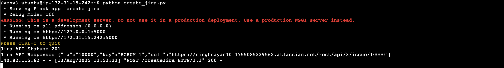
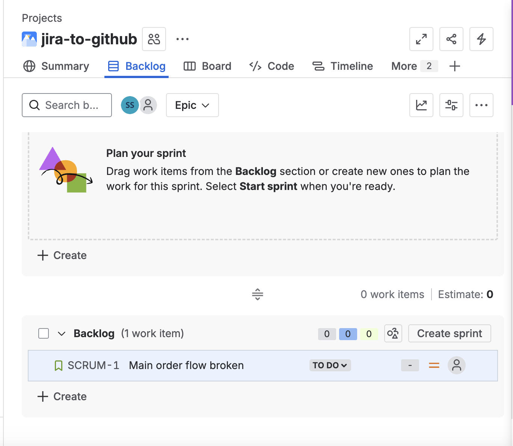
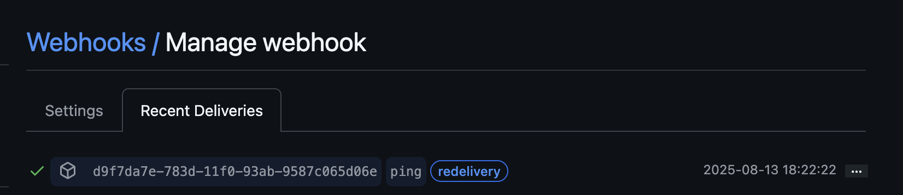

# GitHub → Jira Integration using Flask & AWS EC2

This project demonstrates how to automatically create Jira issues when specific events occur in a GitHub repository.  
The integration is powered by a Flask application hosted on AWS EC2, with GitHub Webhooks triggering Jira REST API calls.

---

## Tech Stack
- **Backend Framework:** Flask (Python)
- **Hosting:** AWS EC2 (Ubuntu)
- **Integration:** Jira REST API
- **Trigger:** GitHub Webhook
- **Authentication:** Jira API Token

---

## Workflow Overview
1. **GitHub Webhook** sends a `POST` request to the Flask server running on EC2.
2. Flask processes the payload and calls the **Jira REST API**.
3. Jira creates a **new issue** in the specified project.

---

## Step-by-Step Setup

### 1. Launch AWS EC2 Instance
1. Open **AWS Console** → Go to **EC2** → Click **Launch Instance**.
2. Choose **Ubuntu** as the OS.
3. Configure **Security Group**:
   - **Port 5000** (Flask app)
   - **Port 22** (SSH access)
4. Launch the instance and connect via SSH:
   ```bash
   ssh -i your-key.pem ubuntu@your-ec2-public-ip
   ```

**Example EC2 Terminal Connection:**  


---

### 2. Install Python & Create Virtual Environment
```bash
sudo apt update
sudo apt install python3 python3-venv python3-pip -y

# Create and activate virtual environment
python3 -m venv venv
source venv/bin/activate
```

---

### 3. Install Required Python Packages
```bash
pip install flask requests
```

---

### 4. Create a Jira Project
1. Log in to your Jira account.
2. Navigate: **Projects → Create Project**.
3. Choose a template (**Scrum**, **Kanban**, or **Bug Tracking**).
4. Assign a **name** and **project key** (e.g., `AB`).
5. Save the project — you'll need the **key** in your Flask app.

---

### 5. Generate Jira API Token
1. Go to **Jira API Token Management**:  
   [https://id.atlassian.com/manage/api-tokens](https://id.atlassian.com/manage/api-tokens)
2. Click **Create API Token** → Give it a label → **Create**.
3. Copy and securely store the token.

**Example Jira Token Screen:**  


---

### 6. Configure GitHub Webhook
1. Go to your **GitHub repository → Settings → Webhooks**.
2. Click **Add Webhook**.
3. Set:
   - **Payload URL:** `http://<EC2-Public-IP>:5000/webhook`
   - **Content type:** `application/json`
4. Select **events** you want to trigger Jira issue creation.
5. Save the webhook.

**Webhook Delivery Example:**  


---

### 7. Run the Flask App
```bash
python app.py
```
Your app will now listen for incoming GitHub events and create Jira issues accordingly.

---

## Post-Project Cleanup
To avoid unnecessary charges and maintain security:
- **Delete AWS EC2 Instance**:  
  Go to **AWS EC2 → Instances → Select → Terminate**.
- **Delete Jira API Token**:  
  Go to [Jira API Token Management](https://id.atlassian.com/manage/api-tokens) → **Revoke** the token.

---

## Summary
This integration enables seamless automation between GitHub and Jira, making project management more efficient. By hosting the Flask app on EC2 and leveraging GitHub Webhooks, you can turn code events into actionable Jira issues instantly.

---
